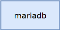

# Blacksmith MariaDB Forge

This Blacksmith Forge teaches a [Blacksmith Broker][broker] how to
deploy standalone and clustered [MariaDB][mariadb] service
deployments, which are useful for all things database.

## Deploying

To deploy this forge, you will need to add it to your existing
Blacksmith Broker manifest deployment, co-locating the
`mariadb-blacksmith-plans` job on the Blacksmith instance group.

Here's an example to get you started (clipped for brevity):

```yaml
releases:
  - name:    mariadb-forge
    version: latest

instance_groups:
  - name: blacksmith
    jobs:
      - name:    mariadb-blacksmith-plans
        release: mariadb-forge
        properties:
          plans:
            # your plans here
            # (see below)
```

The MariaDB Forge deploys mariadb by using jobs that are found
_inside_ the `mariadb-forge` BOSH release, which means that your
Blacksmith BOSH director also needs that release.  Blacksmith is
able to upload that release for you, if you want.

For the Spruce users out there:

```
---
instance_groups:
  - name: blacksmith
    jobs:
      - name: blacksmith
        properties:
          releases:
            - (( append ))
            - (( grab releases.mariadb-forge ))
```

Finally, you'll need to define plans for Blacksmith to deploy.
The following sections discuss those in great detail.

## Standalone Topology

The `standalone` topology is as straightforward as they come: a
singe dedicated VM that runs mariadb bound on all interfaces, to
port 3306.

Here's a diagram to clear things up:



### Configuration Options

- *vm_type* - The name of a BOSH `vm_type` from your cloud-config.
  You can use this to size your MariaDB appropriate to your workload
  requirements, in terms of RAM and CPU.  Increasing the disk size
  via the VM type is not going to net you much of a gain (see
  the `disk_size` and `persist` options instead.

- *network* - The name of the network to deply these instances to.
  This network should be defined in your cloud-config, and should
  be large enough to handle your anticipated service footprint.
  It does not need any static IP addresses.

  By default, VMs will be deployed into a network named
  `mariadb-service`.

- *disk* - The size of the persistent disk where MariaDB will
  store its data files.  By default, you get a 4G disk.  If, for
  whatever reason, you don't _want_ a persistent disk, you can set
  this to `0`.

### Example Configuration

A single standalone plan, persistent, with 4G of disk:

```
instance_groups:
  - name: blacksmith
    jobs:
      - name:    mariadb-blacksmith-plans
        release: mariadb-forge
        properties:
          plans:
            smalldb:
              type: standalone
              disk: 4_096
```

Here's a configuration that provides two different sizes of
persistent standalone, each in their own networks:

```
instance_groups:
  - name: blacksmith
    jobs:
      - name:    mariadb-blacksmith-plans
        release: mariadb-forge
        properties:
          plans:
            small:
              type: standalone
              net:  a-side
              disk: 4_096

            large:
              type: standalone
              net:  b-side
              disk: 16_384
```

## Contributing

If you find a bug, please raise a [Github Issue][1] first,
before submitting a PR.


[1]: https://github.com/blacksmith-community/mariadb-forge-boshrelease/issues
[broker]: https://github.com/cloudfoundry-community/blacksmith
[mariadb]:  https://mariadb.com
